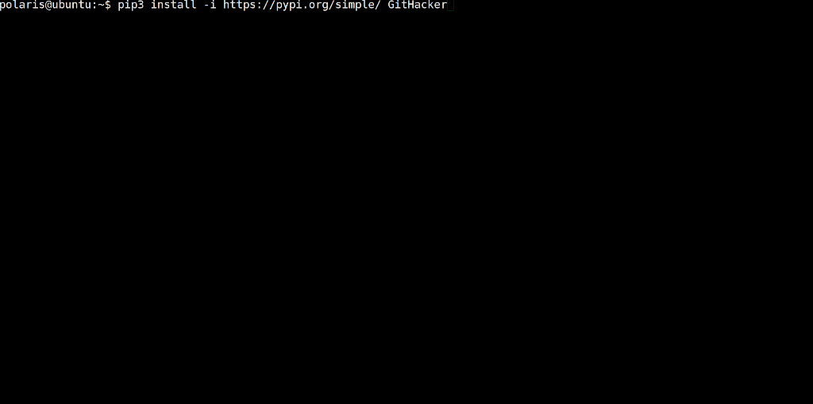

# GitHacker

## Desciption

This is a multiple threads tool to detect whether a site has the `.git` folder 
leakage vulnerability. It is able to download the target `.git` folder almost 
completely. This tool also works when the `DirectoryListings` feature is 
disabled. It is worth mentioning that this tool will download almost all files 
of the target git repository and then rebuild them locally, which makes this 
tool State of the art in this area. For example, tools like [githack] just 
simply restore the latest version. With GitHacker's help, you can view the 
developer's commit history, which makes a better understanding of the character 
and psychology of developers, so as to lay the foundation for further code 
audition.

## Security Issues

#### 2021-08-01 [Fixed](https://github.com/WangYihang/GitHacker/commit/e105b5c04329e9c4b8080029976bc73d12b1f23f): Malicious .git folder maybe harmful to the user of this tool

* [别想偷我源码：通用的针对源码泄露利用程序的反制（常见工具集体沦陷）](https://drivertom.blogspot.com/2021/08/git.html)


## Comparison of other tools

> 2021-05-25

|     Tools     |       Index        |    Source Code     |      Reflogs       |      Stashes       |      Commits       |      Branches      |      Remotes       |        Tags        |
| :-----------: | :----------------: | :----------------: | :----------------: | :----------------: | :----------------: | :----------------: | :----------------: | :----------------: |
|   GitTools    | :heavy_check_mark: | :heavy_check_mark: | :heavy_check_mark: |        :x:         | :heavy_check_mark: |        :x:         | :heavy_check_mark: |        :x:         |
|  dvcs-ripper  | :heavy_check_mark: | :heavy_check_mark: | :heavy_check_mark: |        :x:         | :heavy_check_mark: |        :x:         | :heavy_check_mark: |        :x:         |
|    GitHack    | :heavy_check_mark: | :heavy_check_mark: |        :x:         |        :x:         |        :x:         |        :x:         |        :x:         |        :x:         |
|  git-dumper   | :heavy_check_mark: | :heavy_check_mark: | :heavy_check_mark: | :heavy_check_mark: | :heavy_check_mark: | :heavy_check_mark: | :heavy_check_mark: | :heavy_check_mark: |
| **GitHacker** | :heavy_check_mark: | :heavy_check_mark: | :heavy_check_mark: | :heavy_check_mark: | :heavy_check_mark: | :heavy_check_mark: | :heavy_check_mark: | :heavy_check_mark: |
|   GitTools    |        :x:         | :heavy_check_mark: | :heavy_check_mark: |        :x:         | :heavy_check_mark: |        :x:         | :heavy_check_mark: |        :x:         |
|  dvcs-ripper  |        :x:         |        :x:         |        :x:         |        :x:         |        :x:         |        :x:         |        :x:         |        :x:         |
|    GitHack    |        :x:         | :heavy_check_mark: |        :x:         |        :x:         |        :x:         |        :x:         |        :x:         |        :x:         |
|  git-dumper   |        :x:         | :heavy_check_mark: | :heavy_check_mark: | :heavy_check_mark: | :heavy_check_mark: |        :x:         | :heavy_check_mark: |        :x:         |
| **GitHacker** |        :x:         | :heavy_check_mark: | :heavy_check_mark: | :heavy_check_mark: | :heavy_check_mark: |      :muscle:      | :heavy_check_mark: |      :muscle:      |

## Requirments

* git >= 2.11.0
* Python 3

## Installation

```
pip3 install GitHacker
```

## Usage

```bash
githacker --url http://127.0.0.1/.git/ --folder result
```

## Example



## TODO

- [ ] ~~Download packed files firstly~~ (Unsolvable via [StackOverflow](https://stackoverflow.com/questions/27789484/how-does-git-know-the-sha1-name-of-the-pack-files))
- [x] Download tags and branches when Index enabled
- [x] Try common tags and branches when Index disabled
- [x] [find packed refs](https://github.com/WangYihang/GitHacker/issues/1#issuecomment-487135667)


## Videos
### asciinema

[](https://asciinema.org/a/xgRmZ9dNvzhe3T2XRYDJe15Rj)

### YouTube
* [【.git/ folder attack】Comparison of attack tools (Part I)](https://www.youtube.com/watch?v=Bs3QpVGf2uk)
* [【.git/ folder attack】Comparison of attack tools (Part II)](https://www.youtube.com/watch?v=Xzg4kQt4qEo)

## References

* [Git Repository Layout](https://mirrors.edge.kernel.org/pub/software/scm/git/docs/gitrepository-layout.html)
* [Git Documents](https://git-scm.com/docs)
* [Git Pack filename](https://stackoverflow.com/questions/27789484/how-does-git-know-the-sha1-name-of-the-pack-files)

## Acknowledgement

- [Driver Tom](https://drivertom.blogspot.com)
- [lesion1999](https://github.com/lesion1999)

## Licsence
```
THE DRINKWARE LICENSE

<wangyihanger@gmail.com> wrote this file. As long as 
you retain this :x:tice you can do whatever you want 
with this stuff. If we meet some day, and you think 
this stuff is worth it, you can buy me the following
drink(s) in return.

Red Bull
JDB
Coffee
Sprite
Cola
Harbin Beer
etc

Wang Yihang
```
