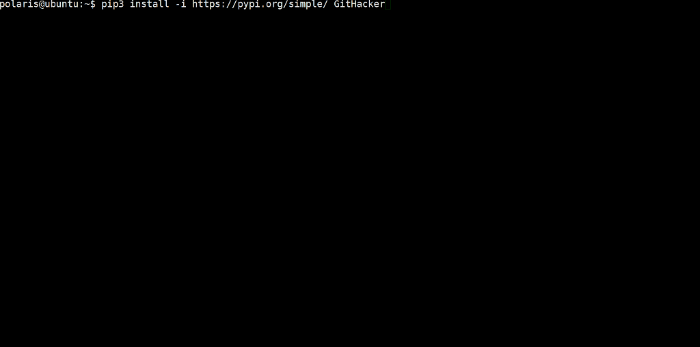

# GitHacker

[](https://badge.fury.io/py/GitHacker)
[](https://pypistats.org/packages/githacker)
[](https://githacker.pages.dev)

A multi-threaded `.git` folder exploitation tool. Reconstructs the
target repository in full — source code, commit history, branches,
stashes, remotes, tags — even when `DirectoryListings` is disabled, by
brute-forcing well-known refs.

The accompanying research site at **<https://githacker.pages.dev>**
publishes:

- A reproducible **[Benchmark](https://githacker.pages.dev/benchmark)** against six other pillagers (GitTools, dvcs-ripper, GitHack, git-dumper, dumpall, rbozburun/git-hacker) across five web-server scenarios.
- An adversarial **[Security suite](https://githacker.pages.dev/security)** that runs every tool against malicious `.git/` directories and tracks coordinated disclosure of findings.
- **[Methodology](https://githacker.pages.dev/methodology)** and **[Reproduce](https://githacker.pages.dev/reproduce)** pages with every detail needed to re-run the harness locally.

## Safety

The remote `.git` you are downloading **may be malicious**. Published
research demonstrates code execution, arbitrary file write, and SSRF
against pillagers via crafted `.git/config`, hooks, submodules, LFS
objects, and HTTP redirects. Run GitHacker **in a disposable
container**:

```bash
docker run -v $(pwd)/results:/tmp/githacker/results \
  wangyihang/githacker \
  --url http://target/.git/ \
  --output-folder /tmp/githacker/results
```

The [Security page](https://githacker.pages.dev/security) tracks both
GitHacker's own hardening history and pre-disclosure findings against
other pillagers.

## Quick start

### Docker (recommended)

```bash
# Help
docker run wangyihang/githacker --help

# Single target
docker run -v $(pwd)/results:/tmp/githacker/results \
  wangyihang/githacker \
  --url http://target/.git/ \
  --output-folder /tmp/githacker/results

# Brute-force branch and tag names (use when directory listing is off)
docker run -v $(pwd)/results:/tmp/githacker/results \
  wangyihang/githacker --brute \
  --url http://target/.git/ \
  --output-folder /tmp/githacker/results

# Multiple targets, one URL per line
docker run -v $(pwd)/results:/tmp/githacker/results \
  -v $(pwd)/websites.txt:/websites.txt \
  wangyihang/githacker --brute \
  --url-file /websites.txt \
  --output-folder /tmp/githacker/results
```

### pip

```bash
pip install GitHacker

githacker --help
githacker --url http://target/.git/ --output-folder result
githacker --brute --url http://target/.git/ --output-folder result
githacker --brute --url-file websites.txt --output-folder result
```

Requirements: `git >= 2.11.0`, Python 3.10+.

## Comparison

Side-by-side results live on the dashboard so the table doesn't drift
out of sync with reality:
**<https://githacker.pages.dev/benchmark>**.

The benchmark regenerates on every benchmark run (weekly via GitHub
Actions, and on demand). At the time of writing, GitHacker is the only
tool that recovers 100% of artifacts across all five web-server
scenarios and 100% PASS on the published adversarial corpus.

## Development

Set up:

```bash
git clone https://github.com/WangYihang/GitHacker
cd GitHacker
uv sync --group dev
```

Run unit tests:

```bash
uv run pytest
```

Run the full benchmark / security harnesses (needs Docker):

```bash
python -m benchmark run        # 7 tools × 5 web-server scenarios
python -m benchmark security   # adversarial corpus
```

Both write JSON into `docs/public/data/`; the docs site picks them up
on its next build. Full harness design:
**<https://githacker.pages.dev/methodology>**.

## Demo



* [.git/ folder attack — comparison of attack tools, Part I](https://www.youtube.com/watch?v=Bs3QpVGf2uk)
* [.git/ folder attack — comparison of attack tools, Part II](https://www.youtube.com/watch?v=Xzg4kQt4qEo)
* [asciinema cast](https://asciinema.org/a/xgRmZ9dNvzhe3T2XRYDJe15Rj)

## References

* [Git Repository Layout](https://mirrors.edge.kernel.org/pub/software/scm/git/docs/gitrepository-layout.html)
* [Git Documentation](https://git-scm.com/docs)
* Justin Steven, *Various abuses of `core.fsmonitor` in a directory's `.git/config`*, 2022 — <https://github.com/justinsteven/advisories>
* Driver Tom, *别想偷我源码：通用的针对源码泄露利用程序的反制*, 2021 — <https://drivertom.blogspot.com/2021/08/git.html>
* [Git project security advisories](https://github.com/git/git/security/advisories)

## Acknowledgements

- [Justin Steven](https://twitter.com/justinsteven) — original `core.fsmonitor` / recursive-downloader advisories (2022).
- [Driver Tom](https://drivertom.blogspot.com) — generic counter-attacks against source-code pillagers (2021).
- [Zac Wang (@7a6163)](https://github.com/7a6163) — path-traversal in `add_head_file_tasks` / `add_hashes_parsed` (CVE pending; folded into the single-trust-gate fix at [`5f2a8ba`](https://github.com/WangYihang/GitHacker/commit/5f2a8ba)).
- [lesion1999](https://github.com/lesion1999) — contributor.
- [shashade250](https://github.com/shashade250) — contributor.

## License

```
THE DRINKWARE LICENSE

<wangyihanger@gmail.com> wrote this file. As long as
you retain this notice you can do whatever you want
with this stuff. If we meet some day, and you think
this stuff is worth it, you can buy me the following
drink(s) in return.

Red Bull
JDB
Coffee
Sprite
Cola
Harbin Beer
etc

Wang Yihang
```
